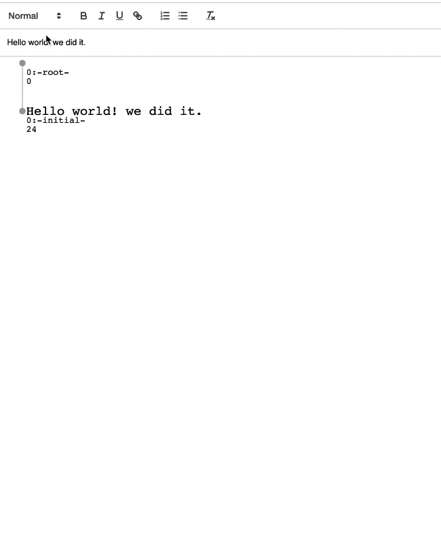

# text-crdt

See [this example](https://github.com/jaredly/local-first/tree/master/examples/quill-crdt) for how to integrate with Quill.

This algorithm is largely based on RGA, with support for rich-text formatting added, along with a number of optimizations.

